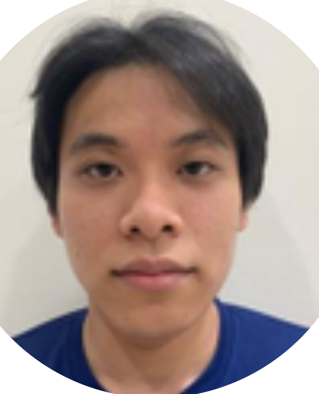
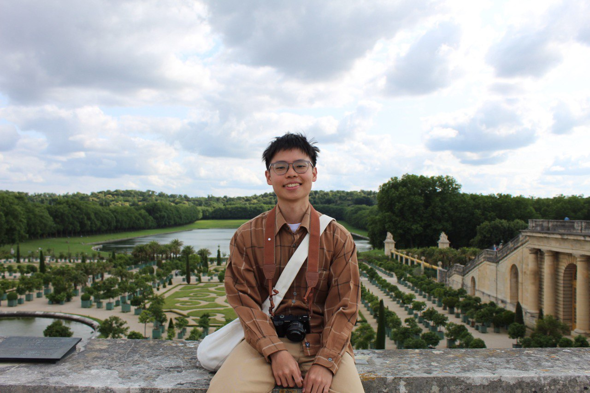
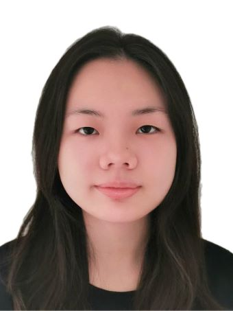
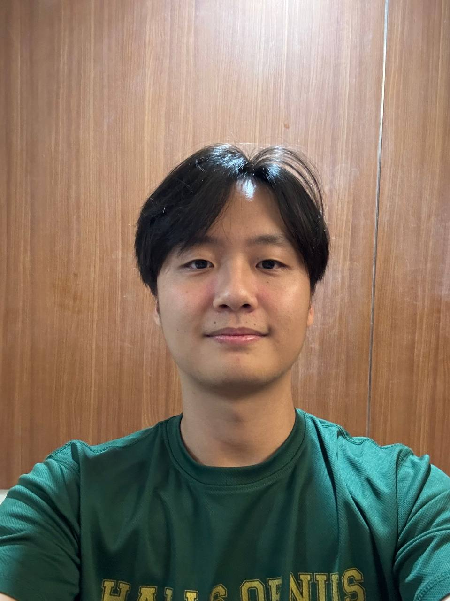

We are a team based in the [School of Computing, National University of Singapore](https://www.comp.nus.edu.sg).

You can reach us at the email `seer[at]comp.nus.edu.sg`

## Project team

### Tan Yu Bin Tevyn

[[homepage](http://www.comp.nus.edu.sg/~damithch)]
[[github](https://github.com/tevyntan)]
[[portfolio](team/tevyn.md)]

* Role: Software Developer

### Jun Wei

[[github](http://github.com/junwei07)]
[[portfolio](team/junwei07.md)]

* Role: Developer
* Responsibilities: UI

### Katrina

[[github](http://github.com/katrinaykt)] [[portfolio](team/katrinaykt.md)]

* Role: CEO
* Responsibilities: Code Structure

### Ray Kye

[[github](http://github.com/RagingRogue)]
[[portfolio](team/ragingrogue.md)]

* Role: Developer
* Responsibilities: Dev Ops + Threading

### Nicha

[[github](http://github.com/mellowfarm)]
[[portfolio](team/mellowfarm.md)]

* Role: Developer
* Responsibilities: UI
