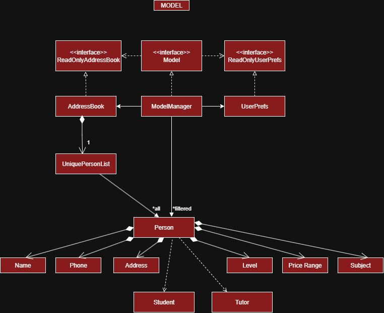
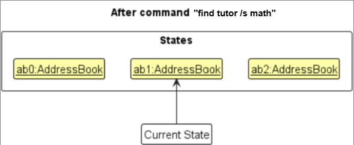
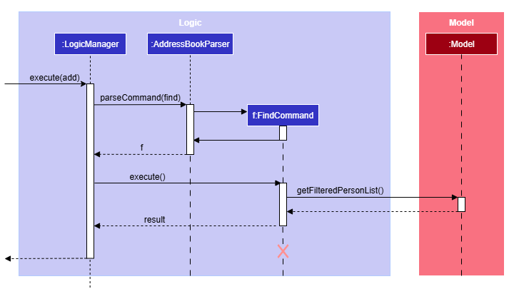

* Table of Contents
{:toc}

--------------------------------------------------------------------------------------------------------------------

## **Acknowledgements**

* {list here sources of all reused/adapted ideas, code, documentation, and third-party libraries -- include links to the original source as well}

--------------------------------------------------------------------------------------------------------------------

## **Setting up, getting started**

Refer to the guide [_Setting up and getting started_](SettingUp.md).

--------------------------------------------------------------------------------------------------------------------

## **Design**

:bulb: **Tip:** The `.puml` files used to create diagrams are in this document `docs/diagrams` folder. Refer to the [_PlantUML Tutorial_ at se-edu/guides](https://se-education.org/guides/tutorials/plantUml.html) to learn how to create and edit diagrams.

### Architecture

The ***Architecture Diagram*** given above explains the high-level design of the App.

Given below is a quick overview of main components and how they interact with each other.

**Main components of the architecture**

**`Main`** (consisting of classes [`Main`](https://github.com/se-edu/addressbook-level3/tree/master/src/main/java/seedu/address/Main.java) and [`MainApp`](https://github.com/se-edu/addressbook-level3/tree/master/src/main/java/seedu/address/MainApp.java)) is in charge of the app launch and shut down.
* At app launch, it initializes the other components in the correct sequence, and connects them up with each other.
* At shut down, it shuts down the other components and invokes cleanup methods where necessary.

The bulk of the app's work is done by the following four components:

* [**`UI`**](#ui-component): The UI of the App.
* [**`Logic`**](#logic-component): The command executor.
* [**`Model`**](#model-component): Holds the data of the App in memory.
* [**`Storage`**](#storage-component): Reads data from, and writes data to, the hard disk.

[**`Commons`**](#common-classes) represents a collection of classes used by multiple other components.

**How the architecture components interact with each other**

The *Sequence Diagram* below shows how the components interact with each other for the scenario where the user issues the command `delete 1`.

Each of the four main components (also shown in the diagram above),

* defines its *API* in an `interface` with the same name as the Component.
* implements its functionality using a concrete `{Component Name}Manager` class (which follows the corresponding API `interface` mentioned in the previous point.

For example, the `Logic` component defines its API in the `Logic.java` interface and implements its functionality using the `LogicManager.java` class which follows the `Logic` interface. Other components interact with a given component through its interface rather than the concrete class (reason: to prevent outside component's being coupled to the implementation of a component), as illustrated in the (partial) class diagram below.

The sections below give more details of each component.

### UI component

The **API** of this component is specified in [`Ui.java`](https://github.com/se-edu/addressbook-level3/tree/master/src/main/java/seedu/address/ui/Ui.java)

The UI consists of a `MainWindow` that is made up of parts e.g.`CommandBox`, `ResultDisplay`, `PersonListPanel`, `StatusBarFooter` etc. All these, including the `MainWindow`, inherit from the abstract `UiPart` class which captures the commonalities between classes that represent parts of the visible GUI.

The `UI` component uses the JavaFx UI framework. The layout of these UI parts are defined in matching `.fxml` files that are in the `src/main/resources/view` folder. For example, the layout of the [`MainWindow`](https://github.com/se-edu/addressbook-level3/tree/master/src/main/java/seedu/address/ui/MainWindow.java) is specified in [`MainWindow.fxml`](https://github.com/se-edu/addressbook-level3/tree/master/src/main/resources/view/MainWindow.fxml)

The `UI` component,

* executes user commands using the `Logic` component.
* listens for changes to `Model` data so that the UI can be updated with the modified data.
* keeps a reference to the `Logic` component, because the `UI` relies on the `Logic` to execute commands.
* depends on some classes in the `Model` component, as it displays `Person` object residing in the `Model`.

### Logic component

**API** : [`Logic.java`](https://github.com/se-edu/addressbook-level3/tree/master/src/main/java/seedu/address/logic/Logic.java)

Here's a (partial) class diagram of the `Logic` component:

The sequence diagram below illustrates the interactions within the `Logic` component, taking `execute("delete 1")` API call as an example.

:information_source: **Note:** The lifeline for `DeleteCommandParser` should end at the destroy marker (X) but due to a limitation of PlantUML, the lifeline continues till the end of diagram.

How the `Logic` component works:

1. When `Logic` is called upon to execute a command, it is passed to an `AddressBookParser` object which in turn creates a parser that matches the command (e.g., `DeleteCommandParser`) and uses it to parse the command.
1. This results in a `Command` object (more precisely, an object of one of its subclasses e.g., `DeleteCommand`) which is executed by the `LogicManager`.
1. The command can communicate with the `Model` when it is executed (e.g. to delete a person). 
   Note that although this is shown as a single step in the diagram above (for simplicity), in the code it can take several interactions (between the command object and the `Model`) to achieve.
1. The result of the command execution is encapsulated as a `CommandResult` object which is returned back from `Logic`.

Here are the other classes in `Logic` (omitted from the class diagram above) that are used for parsing a user command:

How the parsing works:
* When called upon to parse a user command, the `AddressBookParser` class creates an `XYZCommandParser` (`XYZ` is a placeholder for the specific command name e.g., `AddCommandParser`) which uses the other classes shown above to parse the user command and create a `XYZCommand` object (e.g., `AddCommand`) which the `AddressBookParser` returns back as a `Command` object.
* All `XYZCommandParser` classes (e.g., `AddCommandParser`, `DeleteCommandParser`, ...) inherit from the `Parser` interface so that they can be treated similarly where possible e.g, during testing.

### Model component
**API** : [`Model.java`](https://github.com/se-edu/addressbook-level3/tree/master/src/main/java/seedu/address/model/Model.java)

The `Model` component,

* stores the address book data i.e., all `Person` objects (which are contained in a `UniquePersonList` object).
* stores the currently 'selected' `Person` objects (e.g., results of a search query) as a separate _filtered_ list which is exposed to outsiders as an unmodifiable `ObservableList<Person>` that can be 'observed' e.g. the UI can be bound to this list so that the UI automatically updates when the data in the list change.
* stores a `UserPref` object that represents the user’s preferences. This is exposed to the outside as a `ReadOnlyUserPref` objects.
* does not depend on any of the other three components (as the `Model` represents data entities of the domain, they should make sense on their own without depending on other components)

### Storage component

**API** : [`Storage.java`](https://github.com/se-edu/addressbook-level3/tree/master/src/main/java/seedu/address/storage/Storage.java)

The `Storage` component,
* can save both address book data and user preference data in JSON format, and read them back into corresponding objects.
* inherits from both `AddressBookStorage` and `UserPrefStorage`, which means it can be treated as either one (if only the functionality of only one is needed).
* depends on some classes in the `Model` component (because the `Storage` component's job is to save/retrieve objects that belong to the `Model`)

### Common classes

Classes used by multiple components are in the `seedu.address.commons` package.

--------------------------------------------------------------------------------------------------------------------

## **Implementation**

This section describes some noteworthy details on how certain features are implemented.

### \[Proposed\] Find feature

#### Proposed Implementation

The proposed find mechanism is facilitated by `FindCommand` and its associated predicate classes. It filters the person list based on specified criteria (subject, level, or price range) and displays matching results.

* `FindCommand#execute()` — Executes the find operation by applying the appropriate predicate to filter the list.
* `FindCommandParser#parse()` — Parses and validates user input to create a valid `FindCommand`.

These operations interact with the `Model` interface through `Model#getFilteredPersonList()` to apply the filter and display results.

Given below is an example usage scenario and how the find mechanism behaves at each step.

Step 1. The user launches the application for the first time. The application displays the full list of tutors and students.

Step 2. The user executes `find tutor /s maths` command to find tutors teaching mathematics. The `FindCommandParser` validates the input and creates a `FindCommand`. The command executes and calls `Model#getFilteredPersonList()` with the predicate, filtering the displayed list to show only tutors teaching mathematics.

:information_source: **Note:** If a find command fails validation (e.g., invalid parameters), the `FindCommandParser` will throw a `ParseException`, and the command will not execute. The user will see an appropriate error message.

Step 3. The user executes `list` to view all persons again. The `list` command resets the filter by calling `Model#getFilteredPersonList`, displaying the complete list of tutors and students.

The following sequence diagram shows how a find operation goes through the `Logic` component:

:information_source: **Note:** The lifeline for `FindCommand` should end at the destroy marker (X) but due to a limitation of PlantUML, the lifeline reaches the end of diagram.

#### Design considerations:

**Aspect: How filtering is applied:**

* **Alternative 1 (current choice):** Use JavaFX FilteredList with predicates.
  * Pros: Efficient, leverages JavaFX's built-in filtering mechanism. Automatic UI updates when filter changes. Clean separation of filtering logic through predicate classes.
  * Cons: Filter is stateless - each new find command replaces the previous filter completely.

* **Alternative 2:** Maintain a separate filtered copy of the person list.
  * Pros: More control over the filtering process. Could potentially support multiple simultaneous filters.
  * Cons: More complex implementation. Need to manually sync filtered list with source list when data changes. Higher memory usage.

**Aspect: How to handle empty results:**

* **Alternative 1 (current choice):** Display appropriate message, keep filter applied.
    * Pros: User understands why list is empty. Clear feedback on search outcome.
    * Cons: User must execute `list` to see full list again.

* **Alternative 2:** Automatically reset to full list when no results found.
    * Pros: User always sees something in the list.
    * Cons: Confusing user experience - unclear whether search executed successfully or was ignored.

### \[Proposed\] Data archiving

_{Explain here how the data archiving feature will be implemented}_

--------------------------------------------------------------------------------------------------------------------

## **Documentation, logging, testing, configuration, dev-ops**

* [Documentation guide](Documentation.md)
* [Testing guide](Testing.md)
* [Logging guide](Logging.md)
* [Configuration guide](Configuration.md)
* [DevOps guide](DevOps.md)

--------------------------------------------------------------------------------------------------------------------

## **Appendix: Requirements**

### Product scope

**Target user profile**:

* Primary/secondary school **students** seeking tutors for core subjects (English, Maths, Chinese, Science).
* Freelance **tutors** offering lessons for levels **1–6** (single level or a range).
* Prefers fast, keyboard-centric workflows; comfortable with CLI.
* Needs to **filter** and **match** based on **subject**, **level**, and **price range**.
* Works primarily on desktop (Windows/macOS/Linux) with Java 17+.

**Value proposition**: A focused CLI app that **adds/list/finds tutors & students** with clear validators (subject/level/price), and lets users **match/unmatch** pairs quickly and reliably — faster and more consistent than maintaining spreadsheets or generic contact apps

### User stories

Priorities: High (must have) - `* * *`, Medium (nice to have) - `* *`, Low (unlikely to have) - `*`

| Priority | As a …​                                    | I want to …​                     | So that I can…​                                                        |
| -------- | ------------------------------------------ | ------------------------------ | ---------------------------------------------------------------------- |
| `* * *` | coordinator | **add** a *student* with phone, address, subject, level, price | track requests consistently |
| `* * *` | coordinator | **add** a *tutor* with phone, address, subject, level(s), price | track offers consistently |
| `* * *` | coordinator | **list tutors** / **list students** | focus on one category at a time |
| `* * *` | coordinator | **find** tutors/students by **/s** subject | shortlist relevant candidates |
| `* * *` | coordinator | **find** by **/l** level | ensure level suitability |
| `* * *` | coordinator | **find** by **/p** price range | respect budget constraints |
| `* * *` | coordinator | **match** `t<INDEX>` with `s<INDEX>` | record a pairing |
| `* * *` | coordinator | **unmatch** a tutor or student | correct/undo a pairing |
| `* * *` | coordinator | **delete** `t<INDEX>` or `s<INDEX>` | remove obsolete entries |
| `* *` | coordinator | see clear error messages for invalid inputs | fix mistakes quickly |
| `* *` | coordinator | prevent duplicates by name+phone+type | keep data clean |
| `*` | coordinator | edit entries after creation | adjust details without re-adding |

*{More to be added}*

### Use cases

(For all use cases below, the **System** is the `ConnectEd` and the **Actor** is the `user`, unless specified otherwise)

**Use case: Add a student/tutor**

**MSS**

1. User requests to add a person by providing role (tutor/student), name, phone, address, subject, level, and price.
2. ConnectEd validates all fields.
3. ConnectEd adds the new person to the database.
4. ConnectEd shows a success message and the updated list.
Use case ends.

**Extensions**

* 2a. One or more fields are missing or in the wrong format.
 
    ConnectEd shows an error message indicating the invalid/missing field(s).
 
    Use case resumes at step 1 with corrected input.

* 2b. A duplicate person (same role, same name, same phone) exists.
  ConnectEd rejects the add and shows a duplicate warning.
  
    Use case ends.

* 3a. Storage fails (e.g., I/O error).
  * 3a1. ConnectEd shows “Error saving data: add”.
  
    Use case ends.

**Use case: List tutors/students**

**MSS**

1. User requests to list either tutors or students.

2. ConnectEd shows the requested list with indices.

   Use case ends.

**Extensions**

* 1a. The parameter is missing or invalid.
    * 1a1. ConnectEd shows “Wrong command format! Please use ‘list <tutors/students>’ ”.
        
        Use case ends.

* 2a. The requested list is empty.
  * 2a1. ConnectEd shows “No <tutors/students> in the list yet!”.
  
    Use case ends.

**Use case: Find tutors/students (by subject / level / price)**

**MSS**

1. User requests to find either tutors or students with a field filter (/s, /l, or /p) and a value.

2. ConnectEd validates the role, field, and filter value.

3. ConnectEd displays the filtered list with indices.

   Use case ends.

**Extensions**

* 2a. Role is missing or not tutor/student.
  * 2a1. ConnectEd shows “Please specify whether you are finding a tutor or student!”.
  
    Use case ends.

* 2b. Field is not one of /s, /l, /p.
  * 2b1. ConnectEd shows “Field must be /s (subject), /l (level), or /p (price range)!”.
    
    Use case ends.

* 2c. Filter value is malformed (e.g., level not 1–6; price not min-max).
  * 2c1. ConnectEd shows “Filter must match the field type (e.g., /l <level>, /p <range>).”.
  
    Use case ends.

* 3a. No entries match the filter.
  * 3a1. ConnectEd shows “No <tutors/students> found matching the filter!”.
  Use case ends.

* 3b. The underlying list for that role is empty.
  * 3b1. ConnectEd shows “There are no <tutors/students> yet!”.
  
    Use case ends.

**Use case: Match a tutor to a student**

**Preconditions: At least one tutor and one student exist and are visible (possibly after list/find).**

**Guarantees: On success, both sides reflect a bidirectional match.**

**MSS**

1. User requests to match using visible indices: match `t<INDEX>` `s<INDEX>`.

2. ConnectEd validates both indices against the currently displayed Tutor list and Student list.

3. ConnectEd checks that neither party is already matched.

4. ConnectEd links the tutor and student (one-to-one) and updates both profiles.

5. ConnectEd shows success message (e.g., “Matched t1 Alice with s2 Ben”).

    Use case ends.

**Extensions**

* 2a. Either index is invalid/out of range/not visible.
  * 2a1. ConnectEd shows an index error (role-specific).
  
    Use case resumes at step 1.

* 3a. Tutor is already matched.
  * 3a1. ConnectEd shows “Tutor <TutorName> is already matched to <OtherStudentName>. Unmatch first.”
  
    Use case ends.

* 3b. Student is already matched.
  * 3b1. ConnectEd shows “Student <StudentName> is already matched to <OtherTutorName>. Unmatch first.”
  
    Use case ends.

* 4a. The exact pair is already matched (idempotent).
  * 4a1. ConnectEd shows “No change: Tutor <TutorName> is already matched to Student <StudentName>.”
  
    Use case ends.

* 4b. No tutors or students exist.
  * 4b1. ConnectEd shows “There are no tutors and students to match!”.
  
    Use case ends.

* 4c. Storage fails.
  * 4c1. ConnectEd shows “Error saving data: match”.
  
    Use case ends.

**Use case: Unmatch a tutor and student**

**Preconditions: The specified tutor or student is currently matched.**

**Guarantees: On success, neither side remains matched.**

**MSS**

1. User requests to unmatch by specifying one side: unmatch `t<INDEX>` or unmatch `s<INDEX>`.

2. ConnectEd validates the index against the currently displayed list for that role.

3. ConnectEd verifies there is a linked counterpart.

4. ConnectEd removes the bidirectional link and updates both profiles.

5. ConnectEd shows success message (e.g., “Unmatched t1 Alice and s2 Ben”).

    Use case ends.

**Extensions**

* 2a. Index invalid/out of range/not visible.
  * 2a1. ConnectEd shows a role-specific index error.
  
    Use case resumes at step 1.

* 3a. The specified person is not matched.
  * 3a1. ConnectEd shows “No change: <Role> <Name> is not currently matched.”
    
    Use case ends.

* 4a. Storage fails.
  * 4a1. ConnectEd shows “Error saving data: unmatch”.
    
    Use case ends.

**Use case: Delete a person (tutor/student)**

**Preconditions: If matched, the person must be unmatched first.**

**Guarantees: On success, the person is removed and indices are re-numbered.**

**MSS**

1. User requests to delete a specific person using role + index: delete t<INDEX> or delete s<INDEX>.

2. ConnectEd validates the role and index.

3. ConnectEd confirms the person is not currently matched.

4. ConnectEd deletes the person and updates the list.

5. ConnectEd shows a success message and the refreshed list.

    Use case ends.

**Extensions**

* 2a. Role not specified or wrong format.
  * 2a1. ConnectEd shows “Please specify tutor/student to be deleted using delete `t<index>` or delete `s<index>`!”.
  
    Use case ends.

* 2b. Index invalid/out of range/not visible.
  * 2b1. ConnectEd shows “This person doesn’t exist! Please check the index again”.
  
    Use case ends.

* 3a. Person is matched.
  * 3a1. ConnectEd shows “<Tutor/Student> is matched, please unmatch before deleting …”.
  
    Use case ends.

* 4a. No entries exist for that role.
  * 4a1. ConnectEd shows “There are no <tutors/students> yet!”.
  
    Use case ends.

* 4b. Storage fails.
  * 4b1. ConnectEd shows “Error saving data: delete”.
  
    Use case ends.

**Use case: Save data (automatic)**

**MSS**

1. User executes a data-changing command (e.g., add, match, unmatch, delete).

2. ConnectEd persists the updated data to disk automatically.

    Use case ends.

**Extensions**

* 2a. Data file missing or corrupted on first run.
  * 2a1. ConnectEd shows “No/Corrupted data found, creating new data file”.
  * 2a2. ConnectEd creates a new empty data file.
    
    Use case ends.

* 2b. Storage failure.
  * 2b1. ConnectEd shows “Error saving data: <command>”.
    
    Use case ends.

**Use case: Exit application**

**MSS**

1. User requests to exit the application.

2. ConnectEd ensures all pending data is saved.

3. ConnectEd closes the application.

    Use case ends.

**Extensions**

* 2a. Save fails during exit.
  * 2a1. ConnectEd shows “Error: Unable to exit application”.
  * 2a2. ConnectEd remains open so the user can retry or back up data.
  
    Use case ends.
### Non-Functional Requirements

1.  Should work on any _mainstream OS_ as long as it has Java `17` or above installed.
2.  Should be able to hold up to 1000 persons (500 tutors and 500 students) without a noticeable sluggishness in performance for typical usage.
3.  A user with above average typing speed for regular English text (i.e. not code, not system admin commands) should be able to accomplish most of the tasks faster using commands than using the mouse.
4.  Should respond to any command within 2 seconds under normal load conditions.
5.  Should provide clear and specific error messages for all invalid inputs, guiding users toward correct command format.
6.  Should prevent all duplicate entries as defined by the duplicate handling rules (same type, name, and phone number).
7.  Should recover gracefully from data file corruption by creating a new data file without crashing.
8.  Should validate 100% of user inputs before any data modification to prevent invalid data entry.
9.  Should remain fully operational after any validation error or failed command without requiring restart.
10. Should store all data locally in JSON format that is human-readable and transferable across different operating systems.

### Glossary

* **Mainstream OS**: Windows, Linux, Unix, MacOS
* **Private tuition centre database**: A tuition database that is not meant to be shared with others

#### Definitions
* **Tutor / Student** — Person types managed by the app (case-insensitive tokens `tutor` / `student`).
* **Subject** — One of `{english, maths, chinese, science}`.
* **Level** — Integer 1–6 (students: single level; tutors: single level or range `x-y`, 1≤x≤y≤6).
* **Price range** — `min-max` dollars/hour, integers 1–200, `min ≤ max`, no internal spaces.
* **Typed index** — `t<INDEX>` (tutor) or `s<INDEX>` (student), where `INDEX` is 1-based on the **current** list view.
* **Match** — A one-to-one link between a tutor and a student; **Unmatch** removes that link.
* **Duplicate (person)** — Same type **and** same name (case-insensitive) **and** same phone; duplicates are rejected. 

--------------------------------------------------------------------------------------------------------------------

## **Appendix: Instructions for manual testing**

Given below are instructions to test the app manually.

:information_source: **Note:** These instructions only provide a starting point for testers to work on;
testers are expected to do more *exploratory* testing.

### Launch and shutdown

1. Initial launch

   1. Download the jar file and copy into an empty folder

   1. Double-click the jar file Expected: Shows the GUI with a set of sample contacts. The window size may not be optimum.

1. Saving window preferences

   1. Resize the window to an optimum size. Move the window to a different location. Close the window.

   1. Re-launch the app by double-clicking the jar file. 
       Expected: The most recent window size and location is retained.

1. _{ more test cases …​ }_

### Deleting a person

1. Deleting a person while all persons are being shown

   1. Prerequisites: List all persons using the `list` command. Multiple persons in the list.

   1. Test case: `delete 1` 
      Expected: First contact is deleted from the list. Details of the deleted contact shown in the status message. Timestamp in the status bar is updated.

   1. Test case: `delete 0` 
      Expected: No person is deleted. Error details shown in the status message. Status bar remains the same.

   1. Other incorrect delete commands to try: `delete`, `delete x`, `...` (where x is larger than the list size) 
      Expected: Similar to previous.

1. _{ more test cases …​ }_

### Saving data

1. Dealing with missing/corrupted data files

   1. _{explain how to simulate a missing/corrupted file, and the expected behavior}_

1. _{ more test cases …​ }_
