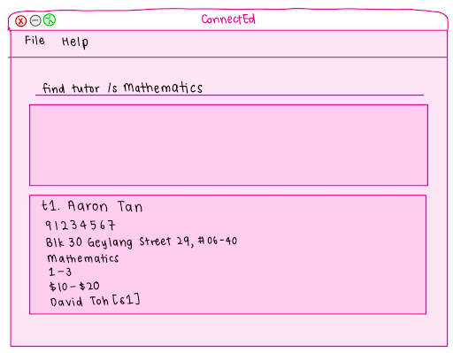
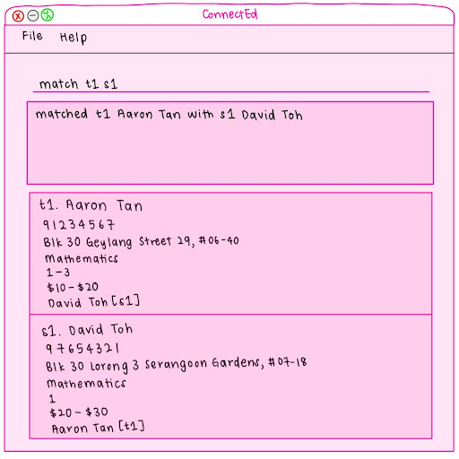

AddressBook Level 3 (AB3) is a **desktop app for managing contacts, optimized for use via a Command Line Interface** (CLI) while still having the benefits of a Graphical User Interface (GUI). If you can type fast, AB3 can get your contact management tasks done faster than traditional GUI apps.

* Table of Contents
{:toc}

--------------------------------------------------------------------------------------------------------------------

## Quick start

1. Ensure you have Java `17` or above installed in your Computer. 
   **Mac users:** Ensure you have the precise JDK version prescribed [here](https://se-education.org/guides/tutorials/javaInstallationMac.html).

1. Download the latest `.jar` file from [here](https://github.com/se-edu/addressbook-level3/releases).

1. Copy the file to the folder you want to use as the _home folder_ for your AddressBook.

1. Open a command terminal, `cd` into the folder you put the jar file in, and use the `java -jar addressbook.jar` command to run the application. 
   A GUI similar to the below should appear in a few seconds. Note how the app contains some sample data. 
   

1. Type the command in the command box and press Enter to execute it. e.g. typing **`help`** and pressing Enter will open the help window. 
   Some example commands you can try:

   * `list` : Lists all contacts.

   * `add n/John Doe p/98765432 e/johnd@example.com a/John street, block 123, #01-01` : Adds a contact named `John Doe` to the Address Book.

   * `delete 3` : Deletes the 3rd contact shown in the current list.

   * `clear` : Deletes all contacts.

   * `exit` : Exits the app.

1. Refer to the [Features](#features) below for details of each command.

--------------------------------------------------------------------------------------------------------------------

## Features

**:information_source: Notes about the command format:** 

* Words in `UPPER_CASE` are the parameters to be supplied by the user. 
  e.g. in `add n/NAME`, `NAME` is a parameter which can be used as `add n/John Doe`.

* Items in square brackets are optional. 
  e.g `n/NAME [t/TAG]` can be used as `n/John Doe t/friend` or as `n/John Doe`.

* Items with `…`​ after them can be used multiple times including zero times. 
  e.g. `[t/TAG]…​` can be used as ` ` (i.e. 0 times), `t/friend`, `t/friend t/family` etc.

* Parameters can be in any order. 
  e.g. if the command specifies `n/NAME p/PHONE_NUMBER`, `p/PHONE_NUMBER n/NAME` is also acceptable.

* Extraneous parameters for commands that do not take in parameters (such as `help`, `list`, `exit` and `clear`) will be ignored. 
  e.g. if the command specifies `help 123`, it will be interpreted as `help`.

* If you are using a PDF version of this document, be careful when copying and pasting commands that span multiple lines as space characters surrounding line-breaks may be omitted when copied over to the application.

### Viewing help : `help`

Shows a message explaining how to access the help page.

Format: `help`

### Adding a person: `add`

Adds a person to the address book.

Format: `add n/NAME p/PHONE_NUMBER e/EMAIL a/ADDRESS [t/TAG]…​`

:bulb: **Tip:**
A person can have any number of tags (including 0)

Examples:
* `add n/John Doe p/98765432 e/johnd@example.com a/John street, block 123, #01-01`
* `add n/Betsy Crowe t/friend e/betsycrowe@example.com a/Newgate Prison p/1234567 t/criminal`

### Listing all persons : `list`

Shows a list of all persons in the address book.

Format: `list`

### Editing a person : `edit`

Edits an existing person in the address book.

Format: `edit INDEX [n/NAME] [p/PHONE] [e/EMAIL] [a/ADDRESS] [t/TAG]…​`

* Edits the person at the specified `INDEX`. The index refers to the index number shown in the displayed person list. The index **must be a positive integer** 1, 2, 3, …​
* At least one of the optional fields must be provided.
* Existing values will be updated to the input values.
* When editing tags, the existing tags of the person will be removed i.e adding of tags is not cumulative.
* You can remove all the person’s tags by typing `t/` without
    specifying any tags after it.

Examples:
*  `edit 1 p/91234567 e/johndoe@example.com` Edits the phone number and email address of the 1st person to be `91234567` and `johndoe@example.com` respectively.
*  `edit 2 n/Betsy Crower t/` Edits the name of the 2nd person to be `Betsy Crower` and clears all existing tags.

### Finding student/tutor: `find`

Returns a filtered list of students/tutors from our database based on one condition (subject, level, or price).

Format: `find <tutor/student> /<field> <filter_value>`
* `<tutor/student>`: specifies whether to search tutors or students.
* `<field>`: must be one of the following keywords:
  * `/s`:  subject
  * `/l`:  level
  * `/p`:  price range
* `<filter_value>`:  the keyword/number/range to match against the chosen field.

Parameter specifications:
* Acceptable values:
  * `<tutor/student>` must be exactly tutor or student (case insensitive).
  * `<field>` must be exactly `/s (subject)`, `/l (level 1–6)`, or `/p (price range)`.
  * `<filter_value>` must match the field:
    * `/s <subject>`:  subject keyword (e.g., mathematics, english, chinese, science)
    * `/l <level>`: integer from 1–6 to simulate primary school p1 - p6.
    * `/p <range>`:  two integers separated by a dash (e.g., 10-20).

Examples:
* `find Tutor /s mathematics` returns `tutors` with `mathematics` as their subject.
* `find tutor /l 3` returns `tutors` that teach children at level `3`.
* `find Student /p 10-20` returns `students` that will accept the price range of `10-20`.
  

### Match/Unmatch a student and a tutor : `match/unmatch`

Link one Tutor and one Student so both are flagged as Matched and hold a bidirectional reference to each other. 
Supports undoing via unmatch.

Format:
* Match: `match t<INDEX> s<INDEX>`
* Unmatch: `unmatch t<INDEX> or s<INDEX>`
* Matches the student and tutor at the specified `INDEX`.
* Unmatch the student/tutor at the specified `INDEX` and its corresponding matched tutor/student.
* The index refers to the index number shown in the displayed tutor/student list.
* The index **must be a positive integer** 1, 2, 3, …​

Examples:
* `match t1 s2` matches the 1st tutor in the tutor list with the 2nd student in the student list.
* `unmatch t1` unmatch the 1st tutor in the tutor list with its corresponding matched student.
  

### Deleting a person : `delete`

Deletes a person (student/tutor) from the ConnectEd database

Format:
* Delete tutor: `delete t<INDEX>`
* Delete student: `delete s<INDEX>`
* Deletes the person at the specified `INDEX`.
* The index refers to the index number shown in the displayed tutor/student list.
* The index **must be a positive integer** 1, 2, 3, …​

Examples:
* `delete t1` deletes the 1st tutor in the tutor list.
* `delete s2` deletes the 2nd student in the student list.

### Clearing all entries : `clear`

Clears all entries from the ConnectEd.

Format: `clear`

### Exiting the program : `exit`

Exits the program.

Format: `exit`

### Saving the data

ConnectEd data are saved in the hard disk automatically after any command that changes the data. There is no need to save manually.

### Editing the data file

ConnectEd data are saved automatically as a JSON file `[JAR file location]/data/addressbook.json`. Advanced users are welcome to update data directly by editing that data file.

:exclamation: **Caution:**
If your changes to the data file makes its format invalid, ConnectEd will discard all data and start with an empty data file at the next run. Hence, it is recommended to take a backup of the file before editing it. 
Furthermore, certain edits can cause the ConnectEd to behave in unexpected ways (e.g., if a value entered is outside of the acceptable range). Therefore, edit the data file only if you are confident that you can update it correctly.

### Archiving data files `[coming in v2.0]`

_Details coming soon ..._

--------------------------------------------------------------------------------------------------------------------

## FAQ

**Q**: How do I transfer my data to another Computer? 
**A**: Install the app in the other computer and overwrite the empty data file it creates with the file that contains the data of your previous AddressBook home folder.

--------------------------------------------------------------------------------------------------------------------

## Known issues

1. **When using multiple screens**, if you move the application to a secondary screen, and later switch to using only the primary screen, the GUI will open off-screen. The remedy is to delete the `preferences.json` file created by the application before running the application again.
2. **If you minimize the Help Window** and then run the `help` command (or use the `Help` menu, or the keyboard shortcut `F1`) again, the original Help Window will remain minimized, and no new Help Window will appear. The remedy is to manually restore the minimized Help Window.

--------------------------------------------------------------------------------------------------------------------

## Command summary

Action | Format, Examples
--------|------------------
**Add** |`add <tutor/student> <name> /hp <phone> /a <address> /s <subject> /l <level_or_range> /p <min-max>` e.g., `add student aaron /hp 91234567 /a Blk 30 Geylang Street 29, #06-40 /s mathematics /l 3 /p 20-30`
**Clear** | `clear`
**Delete** | `delete INDEX`  e.g., `delete 3`
**Find** | `find <tutor/student> /<field> <filter_value>`  e.g., `find student /s chinese`
**Match/Unmatch** | `match t<INDEX> s<INDEX> / unmatch t<INDEX> or s<INDEX> `  e.g., `match t1 s2 / unmatch t1`
**List** | `list students / list tutors`
**Help** | `help`
